# DataMarks

## Classes

**DataMarks**

The DataMarks class is a minimal type signature that should be extended by every component that will furnish data and draw shapes based on that data.

#### Required properties

- config: VicDataMarksConfig

#### Required methods

- setPropertiesFromConfig: () => void;
- resizeMarks: () => void;
- drawMarks: () => void;

**VicDataMarksConfig**

#### Required properties

- data: any[]
  - an array of _any_ type that contains values to visualize

#### Required properties - with default values

- mixBlendMode: string
  - default value: 'normal'
  - defines how overlapping elements are blended

## Token

**DATA_MARKS**

The DATA_MARKS token is used as a type specifier and for Angular's dependency injection.

## Expected patterns of use

The below diagram (requires VSCode Markdown Preview Mermaid Support extension) illustrates how a DataMarks component works together with a scaled Chart component to create an expandable system with shared scales that
will update DOM elements when data/te config updates as well as when the chart is resized by the user/browser.

In the diagram, the top olive box represents the component initialization phase. The dark teal box represents the update and draw from a config/data change cycle, and the green box (lowest) represents the update and draw from a chart size change cycle.

Additional components akin to the AxisComponent in the chart can be added ad nauseum, and make use of the updated scales that emit from the ScaledChartComponent, but that are set from the DataMarksComponent.

```mermaid
sequenceDiagram
    participant DataMarksComponent
    participant ScaledChartComponent
    participant AxisComponent
    rect rgb(50, 50, 0)
    Note over DataMarksComponent: Subscribe to scales<br/>Subscribe to ranges
    Note over AxisComponent: Subscribe to scales
    ScaledChartComponent->>DataMarksComponent: Emit ranges
    end
    rect rgb(0, 50, 50)
    Note over DataMarksComponent: Create scales from config / ranges
    DataMarksComponent->>ScaledChartComponent: Update scales
    ScaledChartComponent->>DataMarksComponent: Emit updated scales
    ScaledChartComponent->>AxisComponent: Emit updated scales
    Note over DataMarksComponent: Draw scaled marks
    Note over AxisComponent: Draw scaled axis
    end
    rect rgb(0, 100, 50)
    Note over ScaledChartComponent: Chart gets resized
    ScaledChartComponent->>DataMarksComponent: Emit ranges
    Note over DataMarksComponent: Update scales from config / ranges
    DataMarksComponent->>ScaledChartComponent: Update scales
    ScaledChartComponent->>DataMarksComponent: Emit updated scales
    ScaledChartComponent->>AxisComponent: Emit updated scales
    Note over DataMarksComponent: Draw scaled marks
    Note over AxisComponent: Draw scaled axis
    end
```

